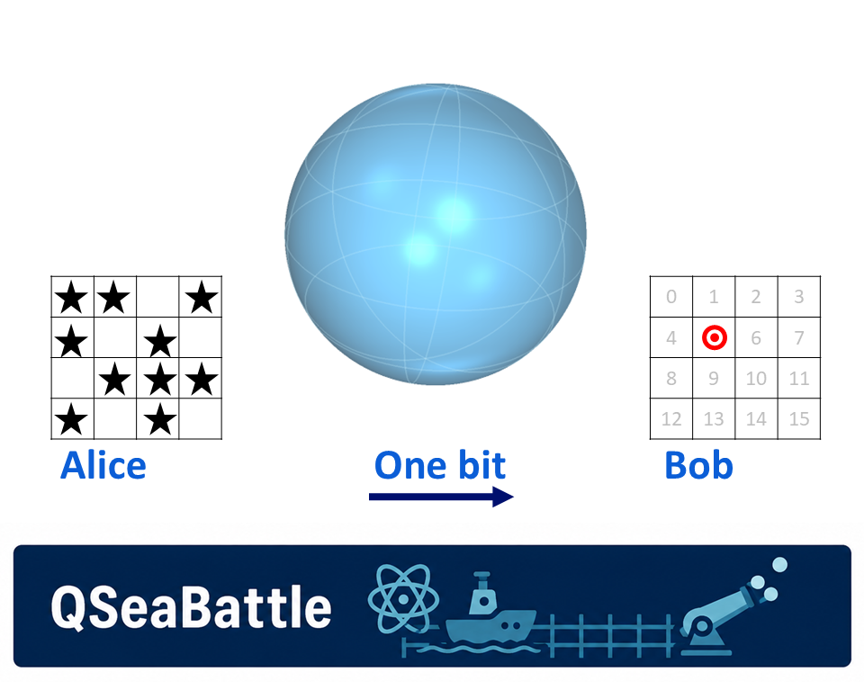

# Quantum Mechanics Should Make This More Complicated. It Doesn’t.

*A guessing game becomes geometrically more and more complicated — until we add quantum mechanics.*

Alice and Bob are playing an almost trivial guessing game. Alice sees a board of bits, Bob has to guess the value at one randomly chosen position, and Alice may send him only a single bit before she knows which position he will be asked about.

Yet when we try to describe **all** the strategies they can use, something unexpected happens. The optimal classical strategies form a many-faced polytope. For a board with 4 cells the strategy polytope lives in four dimensions and different slices through it produce strikingly different shapes. For 6 cells merely resolving the tied inputs gives Alice **184,756 equally optimal deterministic strategies**.

So what happens when we add quantum mechanics?

Surely the geometry should become even more complicated.

It doesn't.

For the quantum construction we will use, all those different shapes collapse onto one of the simplest objects in geometry: a sphere.

How can adding quantum mechanics make the problem *simpler*?

## QSeaBattle Revisited

Alice sees a board containing *n* bits, while Bob is asked about one randomly chosen position. His job is simple: guess whether the bit at that position is 0 or 1. There is just one catch: Alice may send Bob one bit, and Bob does not get to tell her which position he will be asked about.

For *n* = 2, Alice might simply send the first bit. Bob then answers perfectly when asked about position 1, but learns nothing useful about position 2. Sending the second bit merely reverses the problem.

Classically, Alice and Bob therefore have to decide **where to place their advantage**.

We can measure that advantage separately for every possible question. Let *Pᵢ* be Bob's probability of answering correctly when asked for bit *i*.

*cᵢ* = 2*Pᵢ* − 1.

So *cᵢ* = 0 means Bob is doing no better than a coin toss, while *cᵢ* = 1 means he always gets bit *i* right. A negative value simply means his answer is biased in the wrong direction. We call *c* the **advantage**.

Instead of describing everything Alice and Bob do, we can now represent a strategy by a single point

(*c₁*, *c₂*, …, *cₙ*).

For two questions that point lives on a page. For three, it lives in ordinary three-dimensional space. For four or more, it lives somewhere we can no longer draw directly.

This sounds like another complication. Instead, it gives us a surprisingly powerful question:

**What is the shape of everything Alice and Bob can possibly achieve?**

## Turning a Strategy Into a Shape

Let us start with *n* = 3, where we can still see the complete strategy space.

A strategy is now a point (*c₁*, *c₂*, *c₃*). An axis strategy, for example, can put all the advantage on one question, giving a point such as (1, 0, 0). A majority strategy spreads its advantage over all three, giving (½, ½, ½).

Flipping answers or exchanging indices produces symmetry-related versions of these strategies.

Alice and Bob are also not restricted to choosing one deterministic strategy. They can agree beforehand to randomly alternate between two of them. If they use each half of the time, the resulting advantages are simply the average of the two points.

Vary the probability and every point on the line between those strategies becomes reachable. Mix more strategies and the regions between them fill in.

So the complete classical strategy space is **convex**.

For *n* = 3 its boundary is the object we encountered in [a previous post](https://medium.com/@r.hendriks/f85c58257192), shown in Figure 1: a polytope known as a rhombic dodecahedron.

> *Figure 1: The classical strategy space for three possible questions. Each point represents the advantage Bob can achieve for the three possible indices. Despite the many deterministic strategies, the boundary has just two types of vertices: axis strategies (crimson) and majority strategies (dark orange).*
>
> Alt text: 3D light-blue classical polytope in advantage coordinates c₁, c₂, c₃, with crimson axis-type vertices and dark-orange majority-type vertices.

The geometry is already doing useful work. Many apparently different strategies are merely permutations or sign-flipped versions of one another. Instead of cataloguing every rule Alice and Bob might use, we can study the shape those rules produce.

But now increase the game to four questions.

A strategy becomes (*c₁*, *c₂*, *c₃*, *c₄*).

We have entered four dimensions.

## Looking Into Four Dimensions

We cannot draw a four-dimensional object directly, but we can cut through it.

This is much like a CT scan. A three-dimensional object can be studied through two-dimensional slices; similarly, a four-dimensional object can be studied through three-dimensional slices.

Figure 2 demonstrates the idea while we are still safely in three dimensions.

Cut the *n* = 3 polytope with the plane *c₁* = 0 and its cross-section is a diamond. Turn the cutting plane so that *c₁* = *c₂*, and the same object produces a hexagon.

> *Figure 2: Two 2D cross-sections through the same three-dimensional classical strategy space. A cut perpendicular to (1,0,0) produces a diamond; rotating the cut to be perpendicular to (1,−1,0) produces a hexagon. Cross-sections let us study the same geometry when the full object becomes impossible to draw.*
>
> Alt text: Two 2D cross-sections of the same n = 3 classical polytope. The c₁ = 0 section is a diamond with crimson vertices; the c₁ = c₂ section is a hexagon with crimson and dark-orange vertices.

Nothing about the underlying object changed. We simply looked through it from another direction.

So, let us do the same for *n* = 4.

The simplest cut is *c₁* = 0. We fix Bob's advantage on the first question at zero and look at everything Alice and Bob can still achieve on the remaining three.

The result is Figure 3.

> *Figure 3: A three-dimensional cross-section of the four-dimensional classical strategy space. We can no longer draw the complete n = 4 object, but we can cut through it just as we did in Figure 2. Here the slice c₁ = 0 already reveals a richer collection of vertices and faces.*
>
> Alt text: A 3D cross-section of the 4D classical advantage-space polytope at c₁ = 0. The translucent blue polytope contains several color-coded vertex types and three labelled in-plane directions.

But one slice can be deceptive.

Figure 4 shows four different cuts through exactly the same four-dimensional classical object.

> *Figure 4: Four 3D cross-sections through the same four-dimensional classical strategy space. Different cutting directions reveal strikingly different three-dimensional shapes. The complexity is not an artifact of the projection; it is built into the classical geometry.*
>
> Alt text: Four 3D cross-sections of the same 4D classical polytope, perpendicular to (1, 0, 0, 0), (1, −1, 0, 0), (1, 1, 0, 0), and (1, 1, 1, 1). The resulting blue polyhedra have visibly different shapes.

The first is the *c₁* = 0 slice we have just seen. The other cutting planes are tilted in different directions.

Same game. Same four-dimensional object.

Completely different-looking cross-sections.

And this is where our apparently simple guessing game starts to become rather less simple.

## Where All Those Faces Come From

Where does this classical complexity come from?

Surprisingly, much of it comes from something we already encountered in the first QSeaBattle post: **ties**.

When *n* is odd, a majority vote can never end in a draw. Every input has a unique majority.

For even *n*, some boards contain exactly as many zeros as ones. Alice may then choose either value without changing the average success probability.

That freedom looks innocent. Geometrically, it is not.

For *n* = 4 there are 16 possible input strings, six of which are tied. A balanced deterministic encoding divides the 16 strings equally between Alice's two possible messages, giving 12,870 possible balanced encodings.

Most of those are not optimal.

Once we restrict ourselves to the majority-optimal choices, only 20 deterministic encodings remain. Those 20 collapse to 14 distinct points in advantage space, then to three classes under permutation symmetry, and ultimately to only two vertex types.

> *Figure 5: For n = 4, there are 12,870 balanced deterministic encodings. Of these, 20 are majority-optimal. Those 20 collapse to 14 distinct points in advantage space, three classes under permutation symmetry, and finally two vertex types.*
>
> Alt text: A flow diagram for n = 4 showing the reduction from 12,870 balanced deterministic encodings through 20 majority-optimal encodings, 14 distinct advantage-space points and three symmetry classes to two vertex types.

This is still manageable.

Then try *n* = 6.

There are now 64 possible input strings, 20 of which are tied. The number of balanced deterministic encodings exceeds **1.8 × 10¹⁸**.

Even if we ignore almost all of those and look only at the ways of resolving the tied inputs while retaining the majority strategy elsewhere, we still have **184,756** majority-optimal deterministic tie partitions.

After mapping them into advantage space and exploiting symmetry, this enormous collection reduces to 4,733 distinct labelled points, 41 permutation classes, and finally six vertex types.

> *Figure 6: At n = 6 there are more than 1.8 × 10¹⁸ balanced deterministic encodings. Restricting ourselves to the majority-optimal tie choices still leaves 184,756 deterministic strategies. Geometry and symmetry compress these to 4,733 distinct labelled points, 41 permutation classes and six vertex types.*
>
> Alt text: A flow diagram for n = 6 showing the reduction from more than 1.8 × 10¹⁸ balanced deterministic encodings through 184,756 majority-optimal tie partitions, 4,733 advantage-space points and 41 symmetry classes to six vertex types.

So there is order inside the explosion. Symmetry compresses hundreds of thousands of optimal strategies into a relatively small catalogue, but we still have to find the catalogue.

And for larger even *n*, the combinatorics rapidly become worse.

This triggers an interesting mathematical question in its own right: **is there a general way to classify the optimal points and vertices for even *n*?**

The ingredients are quite elementary — binary strings, subsets, permutations and convex hulls — but the resulting geometry is not. For a mathematically inclined student this might even make an interesting research problem (which I have not yet seen in a publication).

But now let us return to the question we started with: What happens when we add quantum mechanics?

## And Then We Add Quantum Mechanics

After everything we have just seen, the natural expectation is clear.

A quantum resource gives Alice and Bob more possible behaviour than a classical one. So surely the already complicated classical polytope should acquire even more vertices, more faces and more strange cross-sections.

Instead, look at Figure 7.

> *Figure 7: The same four cutting directions used in Figure 4, now for the quantum construction. The different classical polyhedra have disappeared: every cross-section is spherical. Instead of adding geometric complexity, the quantum resource removes it.*
>
> Alt text: Four matching cross-sections of the n = 4 quantum advantage space. Unlike the different classical polyhedra in Figure 4, all four are identical translucent blue spheres with great circles and labelled in-plane directions.

The four different classical shapes are gone.

Every cut gives the same sphere.

We added quantum mechanics — and the geometry became **simpler**.

That is the reversal promised at the beginning of this post.

## Why a Sphere?

We already met the smallest version of this in the previous QSeaBattle post.

For two possible questions, the quantum resource allows Alice to redistribute Bob's two advantages continuously. We can write

*c₁* = cos θ,

*c₂* = sin θ,

and therefore

*c₁*² + *c₂*² = 1.

So instead of moving along a straight classical edge, the advantage vector rotates around a circle. For three questions, the same idea becomes an ordinary sphere.

How do we get past three? We don’t invent a new resource for each *n* — we reuse the same one, recursively.

Split the *n* questions into two halves. A first quantum coin — exactly the two-outcome primitive from *n* = 2 — decides how much of the total advantage budget goes to each half: cos²φ to one half, sin²φ to the other. Whatever budget a half receives, it then splits again between its own two halves, using another coin, and so on, until every individual question is left holding its own sliver of the total.

Because each split obeys cos²φ + sin²φ = 1, nothing leaks out along the way — the two children of any split always add back up to their parent’s share. Chase that all the way down the tree and the *n* individual advantages *cᵢ* all out as the leaves of this construction: a set of angles that mathematicians call hyperspherical coordinates. This only closes up neatly when *n* is a power of two, which is why the construction is built by doubling — *n* = 2, 4, 8, …

So, for this binary pyramid construction used here, the pattern continues into higher dimensions. The individual advantages may trade against one another, but their Euclidean length remains fixed:

*c₁*² + *c₂*² + ⋯ + *cₙ*² = 1.

We cannot draw that hypersphere when *n* > 3, but its three-dimensional cross-sections are exactly what we see in Figure 7.

The symmetric strategy lies where the diagonal

*c₁* = *c₂* = ⋯ = *cₙ*

meets this sphere. There,

*cᵢ* = 1/√*n*.

But that familiar symmetric point is only one point on a much larger object. Alice and Bob can gain advantage on one question at the expense of another and move continuously across the spherical boundary.

Classically, those trade-offs generate flat faces. Quantum mechanically, they become rotations.

## From Thousands of Rules to One Equation

This is perhaps the strangest part of the story.

On the classical side, even identifying the extreme strategies becomes a combinatorial exercise. At *n* = 6, hundreds of thousands of deterministic tie rules have to be reduced by geometry and symmetry before the structure becomes visible.

On the quantum side, the corresponding family can be summarized by one equation:

*c₁*² + *c₂*² + ⋯ + *cₙ*² = 1.

The complexity has not simply become smaller.

Its **character has changed**.

The classical boundary is made from discrete choices stitched together into faces. The quantum boundary is smooth. Its structure follows from rotations and the familiar sine and cosine correlations of quantum measurements.

So perhaps we should turn our original intuition around.

Quantum mechanics gives Alice and Bob access to strategies that are impossible classically, but that does not mean the mathematical description of those strategies has to become more complicated.

In this game, more physical possibilities produce a simpler geometry.

## But Is the Sphere the End?

There is one important qualification.

The construction discussed here shows how the quantum strategies we use generate the spherical family. In the binary pyramid construction, with *n* = 2ᵈ, the measurement angles act as hyperspherical coordinates and fill the unit sphere.

Showing what this construction can **reach**, however, is not quite the same as proving that no completely different quantum strategy could ever reach beyond it. Establishing the full quantum bound requires the corresponding general quantum constraints.

For the geometric story here, however, another question is even more interesting.

Why should nature stop at the sphere at all?

Imagine a resource stronger than the quantum one. Suppose Alice could somehow arrange things so that Bob could perfectly guess **whichever** bit he happened to be asked for.

Then every coordinate could independently reach ±1.

The sphere would no longer be the outer boundary.

It would sit inside something larger.

And that triggers the question for a next post:

**What would a world beyond the quantum sphere look like — and what would go wrong if nature allowed us to live there?**

## References

1. A. Ambainis, D. Leung, L. Mancinska, and M. Ozols, “Quantum Random Access Codes with Shared Randomness,” 2009. arXiv:0810.2937.

2. A. Ambainis, S. Kravchenko, S. Sazim, J. Bae, and A. Rai, “Quantum Advantages in (n,d)→1 Random Access Codes,” 2024.

3. M. Pawłowski and M. Żukowski, “Entanglement Assisted Random Access Codes,” *Physical Review A* **81**, 042326 (2010).

> *[QSeaBattle is on Github](https://robhendrik.github.io/QSeaBattle/)*