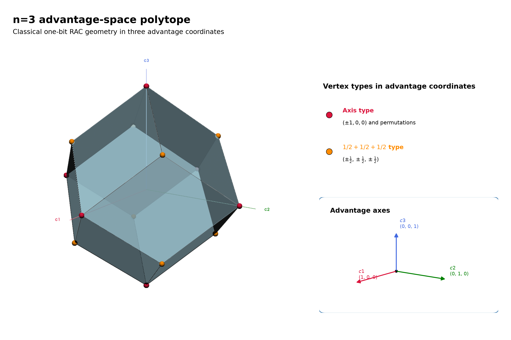
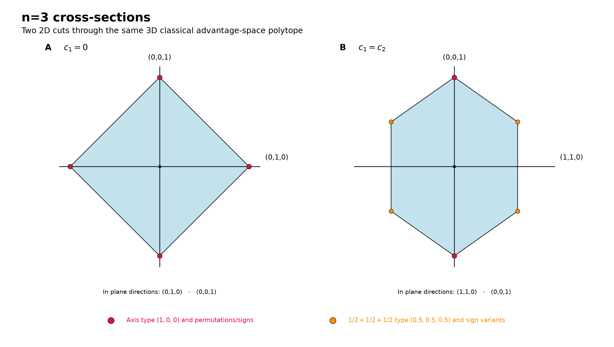
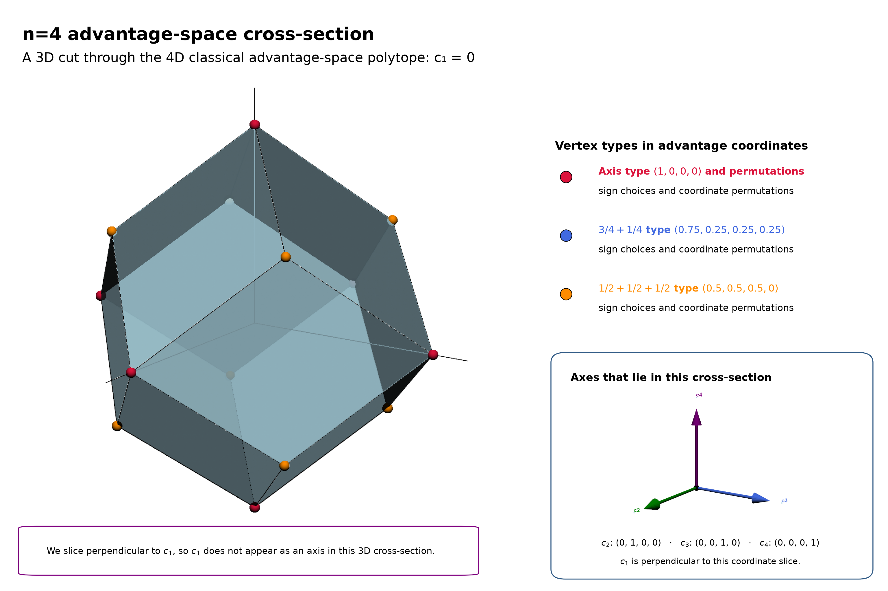
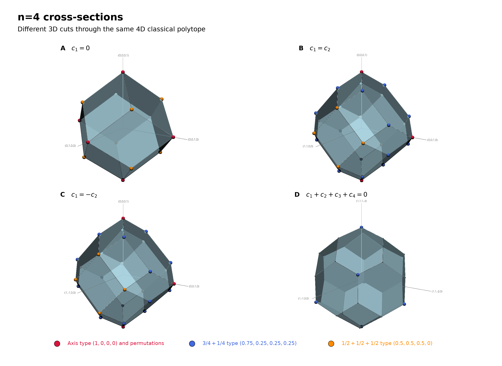
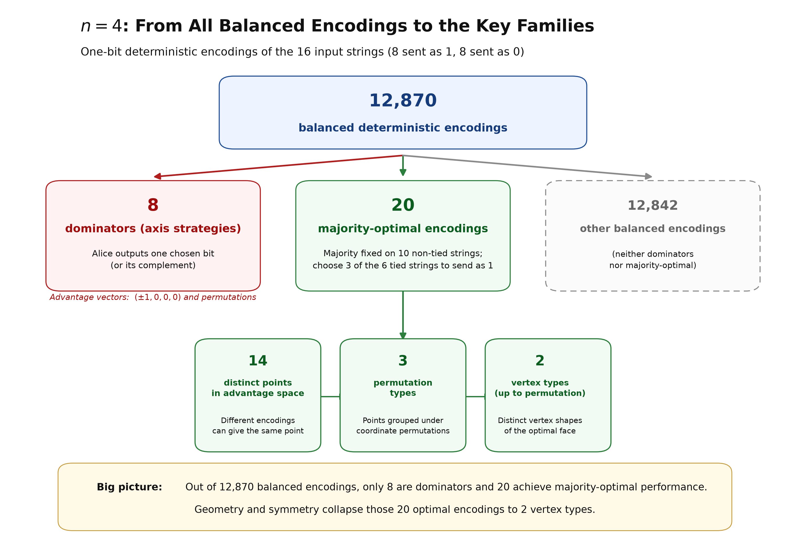
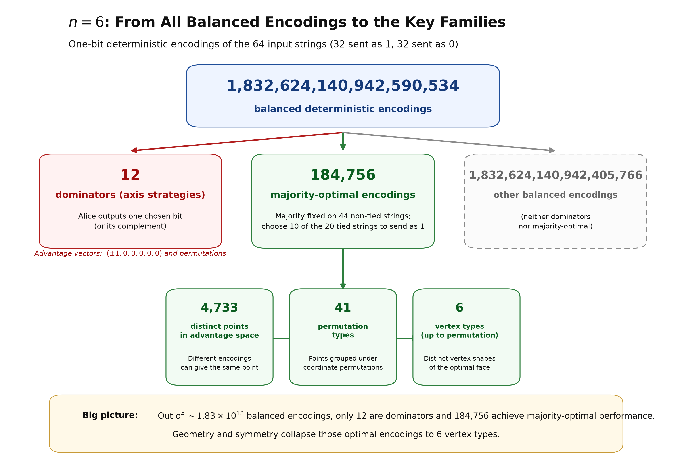
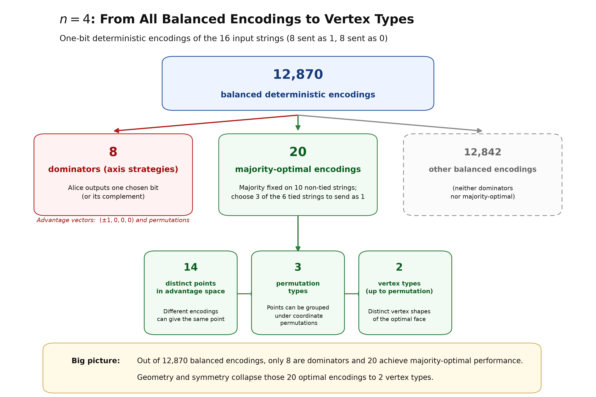

# The Counterintuitive Simplicity of Quantum Guessing Games

*A guessing game, an explosion of classical strategies, and the surprisingly simple shape that quantum mechanics leaves behind.*

## (Q)SeaBattle Revisited
<!-- key Goal: In the minimum possible space, make the game understandable to a new reader and remind returning readers of the setup. End by introducing the advantage coordinates cᵢ = 2Pᵢ − 1 and asking what all possible strategies look like when plotted in these coordinates.-->
Alice and Bob are playing a peculiar version of SeaBattle. It is a simple guessing game with a surprisingly complicated answer. As we increase the number of bits, the space of classical strategies develops more and more vertices, faces and symmetries. We might expect that adding quantum mechanics would make this geometry even more complicated. Instead, almost all of that complexity disappears.

Alice sees a board containing n bits, while Bob is asked about one randomly chosen position. His job is simple: guess whether the bit at that position is 0 or 1. There is just one catch: Alice may send Bob one bit, and Bob does not get to tell her which position he will be asked about.

For n = 2, Alice might see a board with two bits. What should she send? If she sends the first bit, Bob can answer perfectly when asked about position 1, but learns nothing useful about position 2. Sending the second bit merely reverses the problem. Classically, Alice and Bob have to decide where to place their advantage.

We can measure that advantage separately for every possible question. Let *Pᵢ* be Bob's probability of answering correctly when asked for bit *i*, and define *cᵢ* = 2*Pᵢ* − 1. Now *cᵢ* = 0 means Bob is doing no better than a coin toss, while *cᵢ* = 1 means he always gets bit *i* right. A negative value means his answer is biased in the wrong direction. Instead of describing everything Alice and Bob do, we can therefore represent a strategy by a single point (*c₁*, *c₂*, …, *cₙ*).

For two possible questions, that point lives on a page. For three, it lives in ordinary three-dimensional space. For four or more, it lives somewhere we can no longer see directly. That sounds like a complication, but it gives us a surprisingly powerful question to ask: **What is the shape of all the strategies Alice and Bob can possibly reach?**

## What Is the Shape of a Strategy?
<!-- Key goal: Teach the geometric language using n = 3: a strategy becomes a point, mixing fills the space between points, and the boundary becomes a polytope. Then teach cross-sections as the trick that will let us look into four dimensions. -->

Let us start with *n* = 3, where we can still see the whole strategy space. A strategy is now a point (*c₁*, *c₂*, *c₃*) in ordinary three-dimensional space. An axis strategy, for example, can put all the advantage on one question, giving a point such as (1, 0, 0). A majority strategy spreads the advantage equally over all three, giving (½, ½, ½). Flipping answers or exchanging the three indices generates the corresponding points in the other directions.

These points are the extreme deterministic strategies, but Alice and Bob are not restricted to choosing just one of them. They can agree beforehand to randomly alternate between two strategies. If they use each half of the time, their resulting advantages are simply the average of the two points. Vary the mixing probability and every point on the line between them becomes reachable; mix more strategies and the regions between them fill in as well. The set of all classical strategies is therefore convex: its outer boundary is the many-faced object shown in Figure 1, a polytope.

> *Figure 1: The classical strategy space for three possible questions. Each point represents the advantage Bob can achieve for the three possible indices. Despite the many deterministic strategies, the boundary has just two types of vertices: axis strategies (crimson) and majority strategies (dark orange).*
> Alt text: 3D light-blue classical polytope in advantage coordinates c₁, c₂, c₃, with crimson axis-type vertices and dark-orange majority-type vertices.

There is already a lot of symmetry here. Permuting the three questions rotates or reflects the same basic strategies into one another, while flipping an answer changes the sign of the corresponding advantage. That is why many apparently different strategies collapse to only two vertex types in Figure 1. The geometry is giving us a compressed picture of the strategy problem: instead of cataloguing everything Alice and Bob might do, we can study the shape those choices produce.

But this trick seems to have a short life. With n = 4, a strategy becomes (*c₁*, *c₂*, *c₃*, *c₄*), a point in four dimensions. We cannot draw that object directly. Fortunately, we do not need to. Just as a CT scan learns about a three-dimensional object from slices, we can learn about a higher-dimensional strategy space by cutting through it and looking at the lower-dimensional shapes that remain.

Figure 2 demonstrates the idea while we are still safely in three dimensions. Cut the polytope with the plane *c₁* = 0 and its cross-section is a diamond. Turn the cutting plane so that *c₁* = *c₂*, and the same object produces a hexagon. Nothing about the underlying strategy space has changed; we have simply looked through it from a different direction.

> *Figure 2: Two 2D cross-sections through the same three-dimensional classical strategy space. A cut perpendicular to (1,0,0) produces a diamond; rotating the cut to be perpendicular to (1,−1,0) produces a hexagon. Cross-sections let us study the same geometry when the full object becomes impossible to draw.*
> Alt text: Two 2D cross-sections of the same n = 3 classical polytope. The c₁ = 0 section is a diamond with crimson vertices; the c₁ = c₂ section is a hexagon with crimson and dark-orange vertices.

That gives us our way into four dimensions. We will never see the complete *n* = 4 strategy space at once, but we can slice it repeatedly and reconstruct something of its character from the shapes it leaves behind. And, as we will see, those shapes become surprisingly complicated.

## A Shape With Many Faces
<!-- Key goal: Move from n = 3 to n = 4 and reveal that different slices through the same four-dimensional classical object look dramatically different. Introduce symmetry as the only practical way to tame this complexity. -->

Now increase the game from three possible questions to four. A strategy becomes a point (*c₁*, *c₂*, *c₃*, *c₄*) in four-dimensional advantage space. We cannot draw the full object anymore, but Figure 2 has given us a way around that: cut through it with a three-dimensional hyperplane and look at the shape of the intersection.

The simplest cut is *c₁* = 0. We are fixing the advantage on the first question at zero and looking at everything Alice and Bob can still achieve on the other three. The result is Figure 3. It is already noticeably richer than our n = 3 polytope, with several different types of vertices and a more intricate arrangement of faces.

> *Figure 3: A three-dimensional cross-section of the four-dimensional classical strategy space. We can no longer draw the complete n=4 object, but we can cut through it just as we did in Figure 2. Here the slice c₁=0 already reveals a substantially richer collection of vertices and faces.*
> Alt text: A 3D cross-section of the 4D classical advantage-space polytope at c₁ = 0. The translucent blue polytope contains several color-coded vertex types and three labeled in-plane directions.

But one slice can be deceptive. So let us cut the same four-dimensional object in several different directions. Figure 4 shows four such sections. The first is the *c₁* = 0 slice we have just seen. The next two tilt the cutting plane so that *c₁* = *c₂* or *c₁* = −*c₂*. The final cut is perpendicular to the diagonal direction (1, 1, 1, 1). Each time we are looking at the same classical strategy space, yet the three-dimensional object left by the cut can look strikingly different.

> *Figure 4: Four 3D cross-sections through the same four-dimensional classical strategy space. Different cutting directions reveal strikingly different three-dimensional shapes. The complexity is not an artifact: it is built into the classical geometry.*
> Alt text: Four 3D cross-sections of the same 4D classical polytope, perpendicular to (1, 0, 0, 0), (1, −1, 0, 0), (1, 1, 0, 0), and (1, 1, 1, 1). The resulting blue polyhedra have visibly different shapes. 

There is order hiding inside this complexity. Permuting the four indices does not create a fundamentally new strategy, and sign changes generate further symmetry-related copies. We can therefore group large numbers of strategies and vertices into a much smaller number of geometric types. Without those symmetries, even describing the classical object quickly becomes unwieldy. In classical physics, a simple guessing game hides a surprisingly complicated geometry.

> **In classical physics, a simple guessing game hides a surprisingly complicated geometry.**

And four dimensions are only the beginning. The real surprise comes when we ask how many different classical strategies are hiding behind these shapes — and what happens when *n* grows from 4 to 6.

## Where the Complexity Comes From
<!-- Key goal: Explain that the complexity is generated by ties. For odd n there are no majority ties and the optimal structure is clean; for even n, many different tie choices remain equally optimal. Show the explosion from n = 4 to n = 6, then pose the counting/classification problem. -->

Where do all those faces and vertices come from? The culprit is surprisingly simple: ties. When *n* is **odd**, a majority vote can never end in a draw. For every input, one value occurs more often than the other, so the corresponding majority encoding is fixed. This gives the optimal classical strategies their particularly clean structure, whose general form is known [2].

For **even** *n*, something different happens. Some inputs contain exactly as many zeros as ones. On those tied inputs, Alice can choose either value without changing the average success probability. Each choice is still optimal, but different ways of resolving all those ties can produce different advantage vectors. The optimality condition itself is known [2]; it is the geometry generated by this freedom that becomes complicated.

For *n* = 4 there are 16 possible input strings, six of which are tied. A balanced encoding sends eight strings as 0 and eight as 1, giving 12,870 possible balanced deterministic encodings. Among them are the eight simple axis strategies and 20 majority-optimal encodings. Those 20 optimal encodings do not all produce different geometries: they collapse to 14 distinct points in advantage space, then to just three classes under permutation symmetry, and finally to two vertex types.

> *Figure 5: For n = 4, 12,870 balanced deterministic encodings collapse to just two vertex types. The reduction happens in three steps: 1) different encodings can produce the same point in advantage space; 2) permutation symmetry over the indices makes some of the remaining points equivalent; and 3) points that are not vertices of the polytope can be discarded.*
> Alt text: A flow diagram for n = 4 deterministic strategies. It shows the reduction from 12,870 balanced encodings through majority-optimal encodings and distinct advantage-space points to progressively fewer symmetry classes. The final result is 2 vertex types.

At *n* = 6, the same mechanism explodes. There are now 64 possible input strings and 20 ties. The number of balanced encodings exceeds 1.8 × 10¹⁸, while choosing how to resolve just the ties already produces 184,756 majority-optimal encodings. Yet geometry and symmetry compress that enormous collection to 4,733 distinct points in advantage space, 41 classes under permutation, and ultimately six vertex types.

> *Figure 6: The classical complexity grows fast. For n = 6, the number of balanced deterministic encodings exceeds 1.8 × 10¹⁸, with 184,756 majority-optimal encodings alone. The same geometric and symmetry reductions eventually leave just six vertex types — but finding and classifying them is already a substantial combinatorial problem.*
> Alt text: A flow diagram for n = 6 deterministic strategies. It shows the reduction from more than 1.8 × 10¹⁸ balanced encodings through 184,756 majority-optimal encodings and distinct advantage-space points to progressively fewer symmetry classes. The final result is 6 vertex types.

For odd *n*, the optimal classical strategies have a clean structure, and their number is known [2]. For even *n*, ties create a much richer family of equally optimal encodings. The optimality condition is known [2], but the resulting geometry is not classified in the same simple way. What is the general classification of the distinct optimal points — and in particular the vertices — that can be reached for even n?

For an ambitious undergraduate mathematics student, this could make a beautiful problem: part combinatorics, part convex geometry, and easy to explore computationally for small *n*. Find the right general pattern and prove it, and there may even be the seed of a paper here.

> **This could make a beautiful problem: part combinatorics, part convex geometry. Find the right general pattern and prove it, and there may even be the seed of a paper here.**

## And Then We Add Quantum Mechanics
<!-- Key goal: Deliver the reversal promised by the title. We expect quantum resources to add another layer of complexity. Instead, the complicated classical geometry becomes a hypersphere. End by asking why nature chooses this remarkably simple boundary — and what might lie beyond it. -->

After all that classical complexity, we might expect quantum mechanics to make matters worse. More resources, more possible strategies, more complicated geometry. Instead, something remarkable happens. Give Alice and Bob the quantum resources from our earlier game, and the irregular polytope gives way to a sphere. The four very different classical cross-sections in Figure 4 become the four identical spherical cross-sections in Figure 7.

> *Figure 7: Now add the quantum resource. These are the same four cross-sections as in Figure 4. The complicated classical polyhedra are gone: every cut is a sphere. Instead of making the strategy space more complicated, quantum mechanics makes its geometry remarkably simple.*
> Alt text: Four matching cross-sections of the n = 4 quantum advantage space. Unlike the different classical polyhedra in Figure 4, all four are identical translucent blue spheres with great circles and labeled in-plane directions.

Pawłowski and Żukowski showed how the basic quantum guessing strategy can be concatenated to build larger random-access codes, reaching the symmetric advantage $cᵢ$ = 1/√$n$ [3]. Here we take the geometric viewpoint one step further. Rather than looking only at that symmetric point, we allow the individual advantages to trade against one another. In advantage space, those trade-offs trace the remarkably simple boundary shown in Figure 7:

$c₁$² + $c₂$² + ⋯ + $cₙ$² = 1,

So the point $cᵢ$ = 1/√$n$ is just one special point on a much larger object: the point where the diagonal $c₁$ = $c₂$ = ⋯ = $cₙ$ meets the sphere. Move away from that diagonal and Alice and Bob can gain advantage on one question at the expense of another, while remaining on the same smooth boundary. We added quantum mechanics — and the geometry became simpler, not more complicated.

> **We added quantum mechanics — and the geometry became simpler, not more complicated.**

There is something almost suspiciously neat about this. An enormous collection of classical strategies produces a many-faced polytope whose structure rapidly becomes difficult to classify, while the quantum resource replaces it with one of the simplest and most symmetric objects in geometry. The complexity has not merely been reduced; much of its combinatorial character has disappeared.

And that leaves a question which the sphere itself cannot answer. Why should quantum mechanics stop here? Imagine a resource even stronger than the quantum one — one that somehow allowed Bob to guess whichever bit he was asked for perfectly. What shape would that produce in advantage space, and what would it tell us about the boundary between what quantum mechanics permits and what logic alone permits?

That is where we will go next.

## References

1. A. Ambainis, D. Leung, L. Mancinska, and M. Ozols, “Quantum Random Access Codes with Shared Randomness,” 2009. arXiv:0810.2937.

2. A. Ambainis, S. Kravchenko, S. Sazim, J. Bae, and A. Rai, “Quantum Advantages in (n,d)→1 Random Access Codes,” 2024.

3. M. Pawłowski and M. Żukowski, “Entanglement Assisted Random Access Codes,” *Physical Review A* **81**, 042326 (2010).
